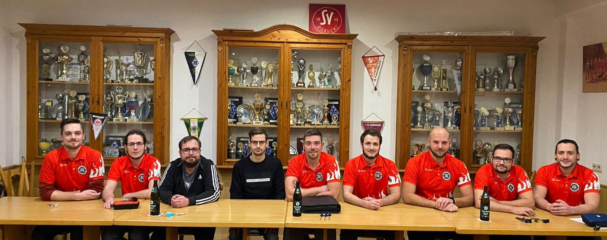

Der Kernvorstand besteht laut unserer Satzung aus dem 1. Vorsitzenden, dessen Stellvertreter (2. Vorsitzender) und dem 1. Kassenwart.
Im erweiterten Vorstand befinden sich 6 weitere Mitglieder. Diese wurden bei der Gründungsversammlung am 15.11.2021 ordnungsgemäß gewählt 
und bilden somit die Vorstandschaft des DC Kirrberg e.V.

Die Verteilung der einzelnen Posten findet ihr in der nachfolgenden Bildbeschreibung.

> Die Vorstandschaft - v.l.n.r. Nicola Kniest (Schriftführer), Maurice Didion (stellv. Schriftführer), Pascal Kittel (1. Beisitzer, Pressesprecher), Phillip Kasper (Kassenwart), Markus Didion (1. Vorsitzender), André Didion (2. Vorsitzender), Patrick Bentz (1. Sportdirektor), Tobias Mallmann (2. Beisitzer), Torsten Halter (2. Sportdirektor)
