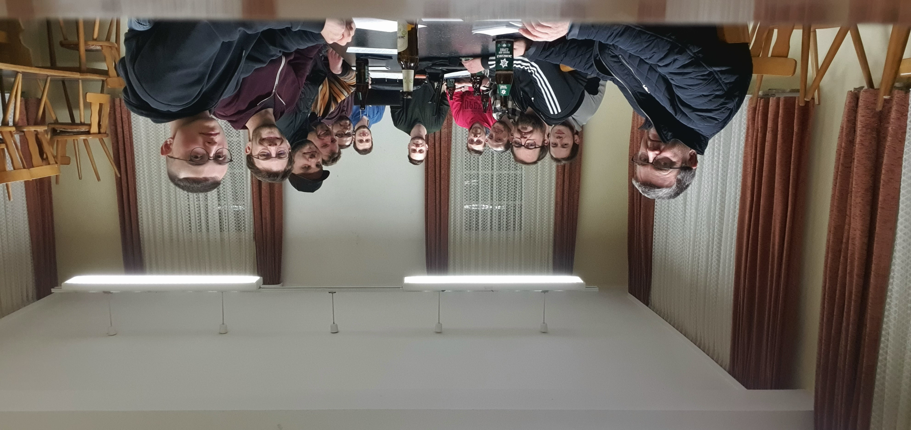

Mit der 1. Mitgliederversammlung stimmte die Versammlung über die erforderlichen Vereins- bzw. Satzungsordungen ab.
Unsere Vereinssatzung und Ordnungen findet ihr unter <a href="/downloads">Downloads</a>.
Der Vorstand verkündete zudem, dass die Räumlichkeit der alten Bücherei im Bürgerhaus Kirrberg, künftig als
Trainingsraum genutzt werden darf.

> Mit viel Enthusiasmus wurde der Grundstein für eine erfolgreiche Vereinsarbeit gelegt