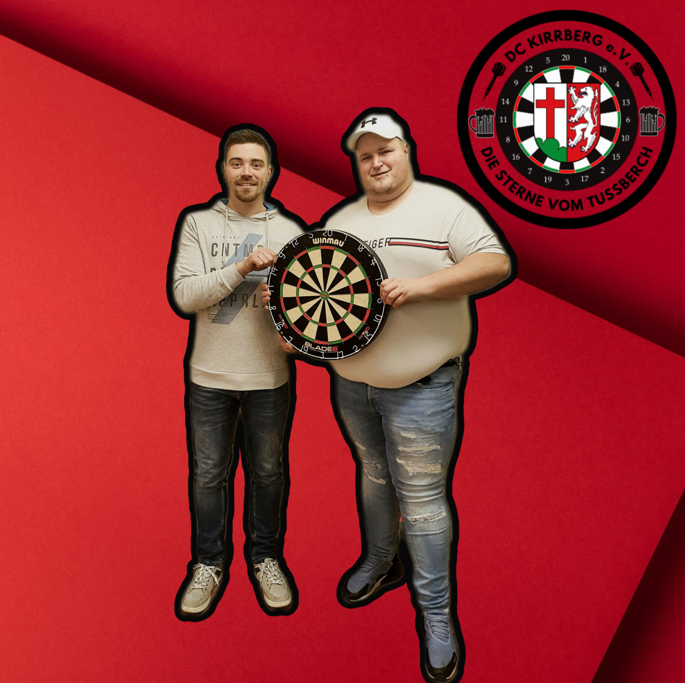
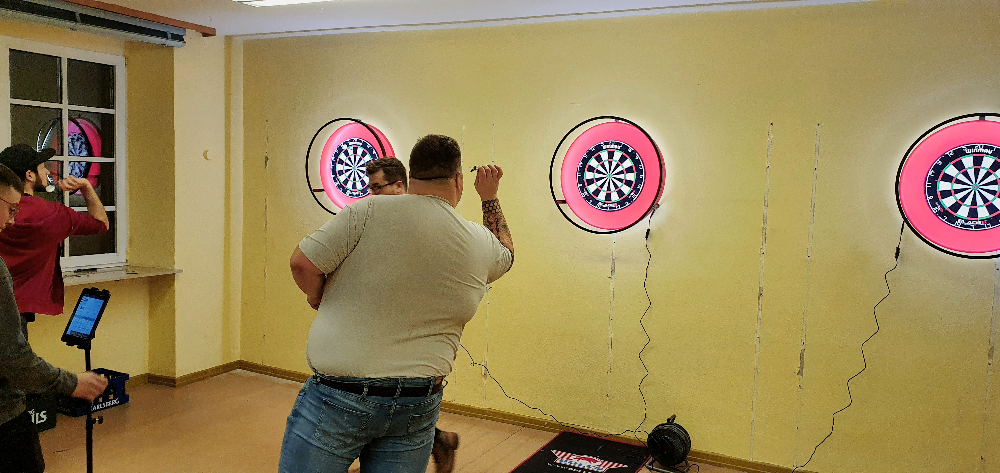

Genau 3 Tage nach der ersten Trainingseinheit, konnten wir bereits unsere Kontakte spielen lassen.
Der Darts Profi - Jens Kniest - war bei uns zu Gast und hatte gleich die ersten Boards und Surrounds mitgebracht.

Der Saarländer Jens Kniest nahm 2018 an der PDC Q-School teil, wonach er regelmäßig bei den Qualifiern für die Events der European Tour mit dabei war, der Sprung auf die große ET-Bühne sollte ihm bisher noch nicht gelingen. Auch ein Jahr später nahm der Deutsche die Q-School in Angriff, anschließend nahm Kniest auch eine Großzahl an Challenge Tour Events mit, bevor er bei den Luxembourg Open die Runde der letzten 32 erreichte. Mitte November gelang dem Dartspieler des DC Olympia dann der große Coup, als er sich für die Super League Darts Germany qualifizieren konnte. 2020 begann Kniest erneut in der Q-School, auf der Challenge Tour ging es zum ersten Mal unter die letzten 32. Auch 2021 war Kniest bei der Q-School mit dabei, ebenso bei der Super League Darts Germany 2021, wo er nach dem Ausscheiden in der Vorrundengruppe die Liga aber vorläufig verlassen muste.

> Der 1. Vorsitzende Markus Didion nimmt die neuen Boards mit Freuden entgegen

> Natürlich wurden die neu erworbenen Scheiben direkt montiert und bespielt!